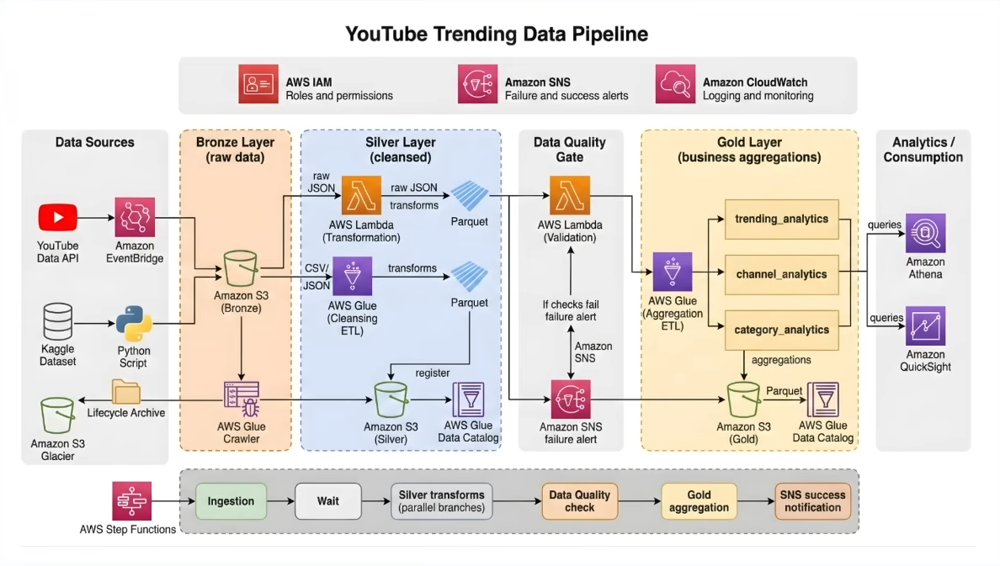

# YouTube Data Engineering Pipeline | AWS

An end-to-end **YouTube Data Engineering pipeline built on AWS** that ingests data from the YouTube API, processes it through a **Bronze → Silver → Gold architecture**, performs automated data quality checks, and orchestrates the complete workflow using AWS Step Functions.

## 🚀 Overview

This project demonstrates a production-style serverless data pipeline for processing YouTube video statistics and reference data.

The pipeline:

- 📥 Ingests data from the YouTube API
- 🥉 Stores raw data in Amazon S3 Bronze
- 🔄 Transforms raw data using AWS Glue and Lambda
- 🥈 Stores cleaned data as Parquet in the Silver layer
- 🧪 Performs automated data quality checks using Lambda + Athena
- 🥇 Processes validated data into the Gold layer
- ⚙️ Orchestrates the complete workflow using AWS Step Functions
- 🔔 Sends success and failure notifications using Amazon SNS

## dataset
Dataset: Raw YouTube datasets are stored in Amazon S3 and excluded from this repository due to GitHub file-size limits.

##  Architecture

The project follows a layered Medallion Architecture consisting of Bronze, Silver, and Gold layers.

